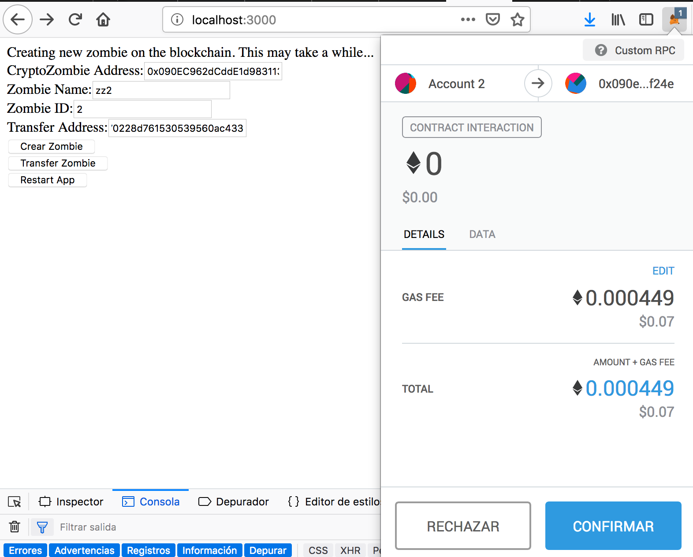
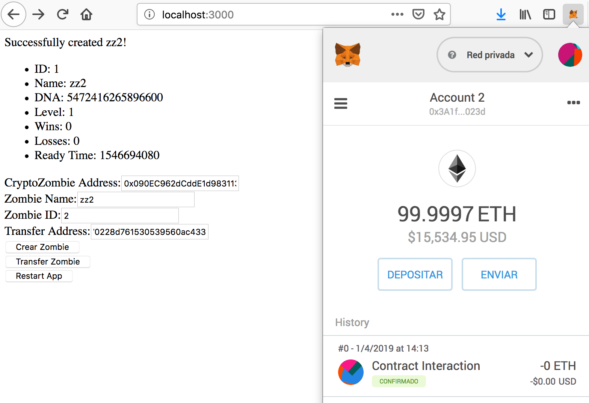

# Running CryptoZombies with Truffle and Metamask

Guidelines to test yourself Ethereum smart contracts as developed by “cryptozombies.io” Solidity tutorial.
(https://medium.com/@jllucini/running-cryptozombies-with-truffle-and-metamask-7991aa0f1250)

## Introduction:

Loom Network has provided a great tutorial to learn Ethereum Blockchain basics.
The blockchain development main concepts are ilustrated through several chapters within a browser-based test environment.
The tutorial finishes with a simple-but-efective dApp development.

## Objective:

This script has the aim to really test the smart contracts and the Dapp in a local blockchain network.
The tools used to test the CryptoZombies concepts are:
* Truffle (https://truffleframework.com/docs/truffle/overview): Ethereum test and development environment.
* Docker (https://docs.docker.com/get-started/): As a repository to CryptoZombies source files.
* Metamask (https://metamask.io/): The bridge to link the local blockchain with the Dapp and a sample wallet.
   It runs in Chrome, Firefox, Opera and Brave browsers.  
* Web3JS (https://web3js.readthedocs.io/en/1.0/): The JAvascript Library used by the Dapp to connect with the local Ethereum blockchain.
   It is injected by Metamask whithin the web running context.
* NPM's "lite-server" (https://www.npmjs.com/package/lite-server): A simple Http Server used for development purposes. 

Docker was used to stablish a ground OS based on Python image. The versions used with this script are:
* Docker Image: python:2.7.15-alpine
    This image is about 100MB small. This approach is better than use a node based image, which  will require to install python additionally (depending on the image).
* Node and npm versions: node v8.14.0, npm 6.4.1
* Truffle: Latest version installed by "npm" 
    Truffle v5.0.1 (core: 5.0.1)
    Solidity - 0.4.19 (solc-js)
* web3js: It it used develoment version 1.0. This is the version used by CryptoZombies tutorial but required some minor changes.
* Metamask: Version 5.2.2, this version imposes some restriction in order to access the Wallet Accounts as described here (https://medium.com/metamask/https-medium-com-metamask-breaking-change-injecting-web3-7722797916a8)
    Additionally changes the way the "web3" object is injected in the execution environment. Therefore the original dApp was updated accordingly to meet Metamask protocol.
    The CryptoZombies dApp is released in "index.html" file.
* lite-server: Latest version installed by "npm" is 2.4.0

## Prerequisites:

To run this script it is needed to have installed Docker and Metmask. Web3js and node are bundled within the Docker image.
The contained exposes ports 3000 - "lite-server" default HTTP port where the dApp runs- and 9545 -the test Truffle network's RPC port-.
Metamask installed in your preferred browser.

## Script:

0. Create docker image o pull from Docker Hub:

   Option a) Create your own docker Image
```
docker build -t cryptodapp .
```

   Option b) Pull and run from Docher Hub repository "jllucini/cryptodapp" (see below).

1. Run docker image :

   Folowing Option a)
```
docker run --name cryptodapp -p 9545:9545 -p 3000:3000 -it cryptodapp /bin/sh
```

   Following Option b)
```
docker run  --name cryptodapp -p 9545:9545 -p 3000:3000 -it jllucini/cryptodapp /bin/sh
```

This command automatically opens a shell within the container in the application folder.

2. Within folder "/home/cryptodapp", install Truffle:
```
npm install -g truffle
```
Some errors are given, but doesn't prevent normal Truffle execution.

3. Build a Truffle project:
```
truffle init 
```

```
/home/cryptodapp # truffle init

✔ Preparing to download
✔ Downloading
✔ Cleaning up temporary files
✔ Setting up box

Unbox successful. Sweet!

Commands:

  Compile:        truffle compile
  Migrate:        truffle migrate
  Test contracts: truffle test
```
4. Prepare the CryptoZombies source code: Copy smart contracts and tune the Truffle project:
```
cp cryptoz/contracts/* contracts
cp cryptoz/migrations/* migrations
cp cryptoz/truffle-config.js .
```
This last step setup Truffle compiler to use v0.4.19 , the one used by CryptoZombies tutorial. Additionally it is changed Migrations.sol to use this same version.
Additionally the contracts source code was changed to use camel case to the contracts source files and import statements, otherwise some compilation errors are thrown.

5. Run Truffle compile, develop and migrate (deploy):
```
truffle compile
```

```
/home/cryptodapp # truffle compile
Compiling ./contracts/ERC721.sol...
Compiling ./contracts/Migrations.sol...
Compiling ./contracts/Ownable.sol...
Compiling ./contracts/SafeMath.sol...
Compiling ./contracts/ZombieAttack.sol...
Compiling ./contracts/ZombieFactory.sol...
Compiling ./contracts/ZombieFeeding.sol...
Compiling ./contracts/ZombieHelper.sol...
Compiling ./contracts/ZombieOwnership.sol...

Compilation warnings encountered:

/home/cryptodapp/contracts/ERC721.sol:1:1: Warning: Source file does not specify required compiler version!Consider adding "pragma solidity ^0.4.19;"
contract ERC721 {
^
Spanning multiple lines.
,/home/cryptodapp/contracts/Ownable.sol:6:1: Warning: Source file does not specify required compiler version!Consider adding "pragma solidity ^0.4.19;"
contract Ownable {
^
Spanning multiple lines.

Writing artifacts to ./build/contracts
```

```
truffle develop
```

```
/home/cryptodapp # truffle develop
Truffle Develop started at http://127.0.0.1:9545/

Accounts:
(0) 0x65873d6bea2547f539ed4bf70b7b064a6acac21c
(1) 0x3a1fc949f9453105aecbc80a532f78e0fb8e023d
(2) 0xf2cac7a30d279787556aac62e8d8c81cd89825da
(3) 0x4da97982044736d9389eaf139ded5e95031dfb60
(4) 0x35fc333982c8174046abd6582b209d61130c7567
(5) 0x7ded9f6913ea7e8ffe3dfdc0436d4b3210d0126b
(6) 0x98b744d40188519ce28dcac8ace79ce2c447d0fb
(7) 0x9789cd5e953dc2dfb987316f59f1b40d5490d9ed
(8) 0xe13089d313274f96e676f24276a0aa3d436db591
(9) 0x3d93a0fb0610871bfe597b2cb2fac9ae1657fc40

Private Keys:
(0) 5ede36f782f618df88f1276f8da8d1985026a5c2b7ab0cef095511336c284db5
(1) 8d904168a2fb79db7da885551ee7e1612505f3cb2502f5e98b130e93011890cd
(2) ddd8dc907f58d2488bf1856ad28bec90e3b292ad64d2a2514bf5ccfff0baa15d
(3) 62211d7960a027eee6246cf352696aa490faf0b8a3b26cf34f2a86e86bf42fe9
(4) 1083d764bcd460528ca7cab3c5a65f5457bd75dac262bfc51268d3af6fce3a4f
(5) 175a15da150f62a2190dbd3ba88991b740f31a446e68744f59e01c2c83b17d4a
(6) 61c80507f9d5997e3a0928c80d111cd414717f452b6e58d8b663198f8e3ecbbc
(7) 8463c924a0f74ecb2572d97748cbdce3306574f2bbae13612f077b4ddd1e4278
(8) 22787faaf20a89a1e006b7c253bafef03b52a8ddb8f7bb0af159512bf143028b
(9) e00414adcd54ae8f5af7cc8ad9fc93b60f3404774ef10ea98e1f4cbb021bbe72

Mnemonic: sea brush lake puppy urge must only seed gentle tragic industry business

⚠️  Important ⚠️  : This mnemonic was created for you by Truffle. It is not secure.
Ensure you do not use it on production blockchains, or else you risk losing funds.

truffle(develop)>
```
This last command runs the local blockchain, take note the Mnemonic seed, it will be needed to configure Metamask accounts.

6. Run the deployment command
```
truffle(develop)> migrate

⚠️  Important ⚠️
If you're using an HDWalletProvider, it must be Web3 1.0 enabled or your migration will hang.


Starting migrations...
======================
> Network name:    'develop'
> Network id:      4447
> Block gas limit: 6721975


1_initial_migration.js
======================

   Deploying 'Migrations'
   ----------------------
   > transaction hash:    0x1597c58c5dc78b018a0a9a7a794a47e098b7938fadfc1292b6ce5c56e5745b96
   > Blocks: 0            Seconds: 0
   > contract address:    0xE560b9F0Ed2B0d5aD28b4067A4c470C2Bdf8BBA8
   > account:             0x65873d6BEa2547f539ED4bf70B7b064a6acAc21c
   > balance:             99.99460786
   > gas used:            269607
   > gas price:           20 gwei
   > value sent:          0 ETH
   > total cost:          0.00539214 ETH


   > Saving migration to chain.
   > Saving artifacts
   -------------------------------------
   > Total cost:          0.00539214 ETH

. . .
  Deploying 'ZombieOwnership'
   ---------------------------
   > transaction hash:    0x0758a2906b8af4f96db216eebd9f6c7a3554585267ff8eeac342ed31cad54f9e
   > Blocks: 0            Seconds: 0
   > contract address:    0x090EC962dCddE1d9831135fA657a35f18E07f24E
   > account:             0x65873d6BEa2547f539ED4bf70B7b064a6acAc21c
   > balance:             99.83174828
   > gas used:            2295843
   > gas price:           20 gwei
   > value sent:          0 ETH
   > total cost:          0.04591686 ETH


   > Saving migration to chain.
   > Saving artifacts
   -------------------------------------
   > Total cost:          0.16201996 ETH


Summary
=======
> Total deployments:   8
> Final cost:          0.1674121 ETH

truffle(develop)> 
```
Take note the Contract Address of smart contract ZombieOwnership, this is the main contract inheriting all the functinoality developed through CryptoZombies tutorial.

With all these 6 steps we have a test blockchain running, it is missing the dApp deployment. For this purpose follow these next steps:

7. Connect to the container in a different termina:
```
docker exec -it cryptodapp /bin/sh
```
This will open a new shell within the running container.

8. Create npm project, use "index.html" as entry point and provide default values:
```
npm init
```

```
/home/cryptodapp # npm init
This utility will walk you through creating a package.json file.
It only covers the most common items, and tries to guess sensible defaults.

See `npm help json` for definitive documentation on these fields
and exactly what they do.

Use `npm install <pkg>` afterwards to install a package and
save it as a dependency in the package.json file.

Press ^C at any time to quit.
package name: (cryptodapp) 
version: (1.0.0) 
description: 
entry point: (truffle-config.js) index.html
test command: 
git repository: 
keywords: 
author: 
license: (ISC) 
About to write to /home/cryptodapp/package.json:

{
  "name": "cryptodapp",
  "version": "1.0.0",
  "description": "",
  "main": "index.html",
  "directories": {
    "test": "test"
  },
  "scripts": {
    "test": "echo \"Error: no test specified\" && exit 1"
  },
  "author": "",
  "license": "ISC"
}


Is this OK? (yes) 
```
9. Setup lite-server:
```
npm install lite-server
cp cryptoz/bs-config.json .
```

10. Copy dApp index.html and web3.js library:
```
cp -r cryptoz/src .
```

11. Edit package.json to add the string "dev": "lite-server", to "script" section: 
    "scripts": {
        "dev": "lite-server",
```
sed -i.bkp '/\"scripts\": {/a \"dev\": \"lite-server\",' package.json
```

12. Finally run the dApp:
```
npm run dev

> cryptodapp@1.0.0 dev /home/cryptodapp
> lite-server

** browser-sync config **
{ injectChanges: false,
  files: [ './**/*.{html,htm,css,js}' ],
  watchOptions: { ignored: 'node_modules' },
  server: 
   { baseDir: [ './src', './build/contracts' ],
     middleware: [ [Function], [Function] ] } }
[Browsersync] Access URLs:
 -----------------------------------
       Local: http://localhost:3000
    External: http://172.17.0.2:3000
 -----------------------------------
          UI: http://localhost:3001
 UI External: http://localhost:3001
 -----------------------------------
[Browsersync] Serving files from: ./src
[Browsersync] Serving files from: ./build/contracts
[Browsersync] Watching files...
[Browsersync] Couldn't open browser (if you are using BrowserSync in a headless environment, you might want to set the open option to false)
```

Now in your host OS can run your browser with Netamask installed: I used Firefox: http://localhost:3000
You can start by selecting "Account 1" in Metamask and create the first CryptoZombi (provide a name in the HTML form).
If Metamask is well configured a popup will be opened to approve the transaction. Remark the smartcontract imposes the requisit to have only one Zombie by contract.
You can use the "Transfer" button to call the transfer zombie smarto contract function.

**Tips**: 
- When you change between Metamask accounts, click "Restart App" to setup the source contract address and reload the owner zombies list.
- The metamask configuration is : Private Network: http://localhost:9545
- In sucesive tests with different seeds you will need to restore your Account transactions, otherwise the blockchain will detect inconsistences.




